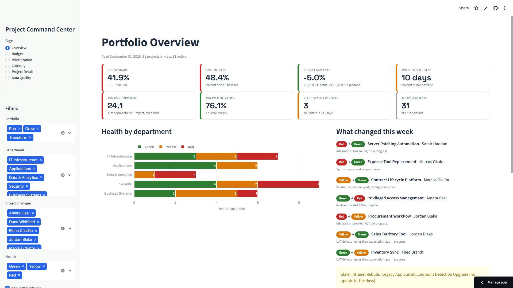
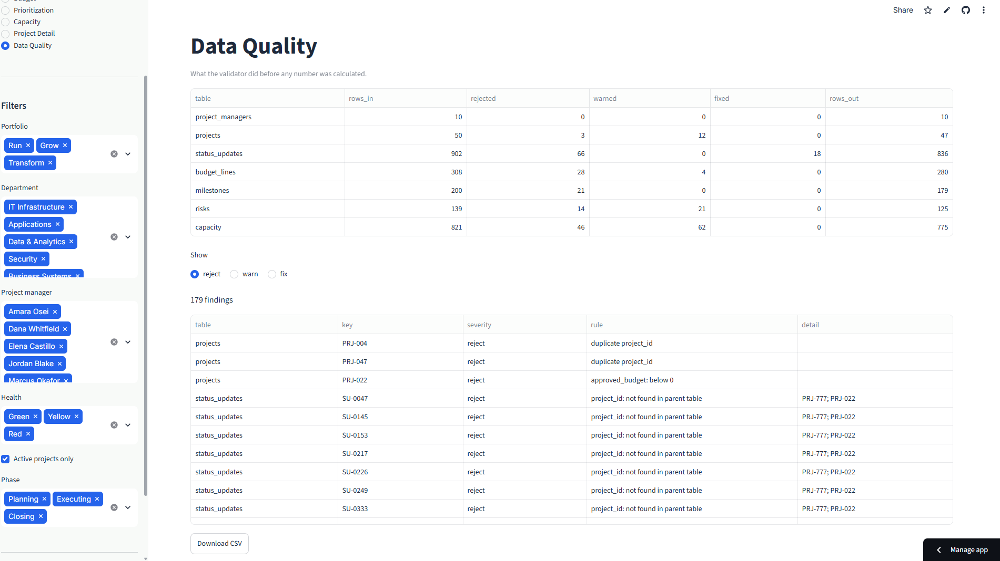
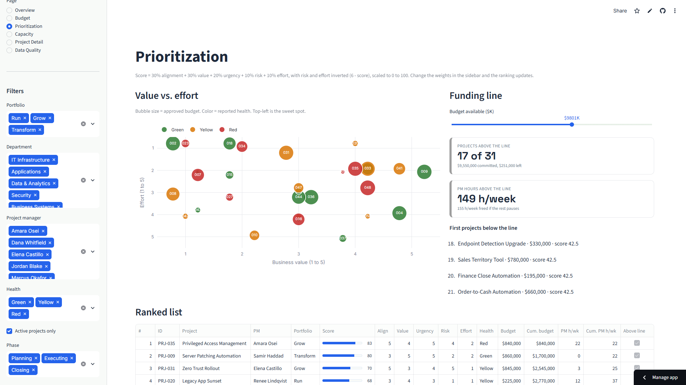
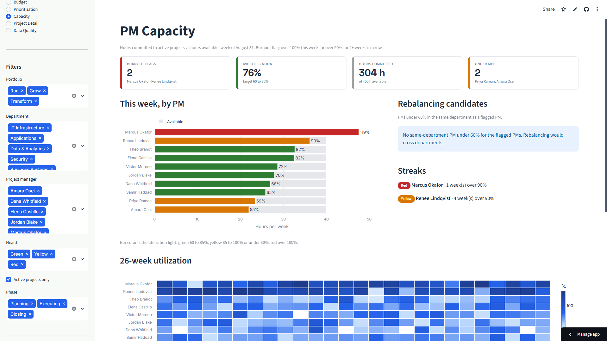

# Project Command Center

**A portfolio management dashboard that treats a project portfolio the way a sales team treats a CRM.**

[**View the live dashboard →**](https://project-command-center-mg.streamlit.app)

`Python` · `pandas` · `Streamlit` · `Plotly` · `Business Analysis` · `Requirements Engineering` · `UAT`



---

## 01. Executive summary

PMO teams track projects in spreadsheets that answer "what is the status" but not
"what should we do next."

Project Command Center is a six-page operational dashboard built on a fictional
portfolio of 40 to 60 IT projects. Every project is a record with a health score, a
budget position, a transparent priority rank, and an owner whose workload is visible
before it becomes a problem.

The work covers a full delivery cycle, not just the build: stakeholder analysis,
current-state process mapping, requirements, user stories with acceptance criteria,
a traceability matrix, a UAT plan, and the application itself.

**Modeled outcome:** 263 analyst hours per year returned to the PMO, roughly $11,835
at a $45 loaded rate, plus decisions that stop slipping a full review cycle.

---

## 02. Business case

A PMO running 40 to 60 projects spends roughly **338 hours a year** on the mechanics
of reporting rather than on analysis.

| Activity | Annual hours |
|---|---|
| Chasing late status updates | 78 |
| Re-keying updates into the master workbook | 104 |
| Reconciling the finance export to the project list | 48 |
| Recalculating and checking KPI formulas | 24 |
| Building the steering committee deck | 84 |
| **Total** | **338** |

At $45 per hour that is roughly **$15,210 a year** of analyst time, before counting
the cost of a funding decision that waits a month because the deck did not anticipate
the question.

The second cost is harder to price. When the same KPI is calculated three different
ways in three different files, the portfolio view stops being trusted, and the
steering committee starts making decisions on anecdote.

---

## 03. Current-state process

Status updates arrive by email or chat in whatever format each project manager has
settled on. The PMO Analyst re-keys them into a master workbook, chases whoever has
not submitted, and reconciles a separate finance export by matching project names
that two systems spell differently.

Prioritization is done once a quarter and is stale by the time it is referenced.
Capacity is not tracked anywhere. The deck is assembled by hand.

📄 **[Full current-state map with BPMN-style diagram →](docs/process-maps.md#22-current-state-process-map)**

---

## 04. Pain points

Ten problems were identified in the current-state analysis. The five that drive the
most requirements:

| ID | Pain point | Consequence |
|---|---|---|
| PP-02 | Status updates re-keyed by hand | Transcription errors, and hours of clerical work weekly |
| PP-03 | Project names do not match across sources | The single largest time cost in the reporting cycle |
| PP-05 | KPI formulas live in spreadsheet cells and drift | The same metric produces different numbers in different files |
| PP-07 | No capacity data exists anywhere | Overload is discovered after a slip or a burnout |
| PP-10 | Staleness is invisible because silence reads as no news | A project can go quiet for a month before anyone notices |

📄 **[Full pain point analysis with traceability →](docs/process-maps.md#23-pain-point-analysis)**

---

## 05. Requirements

30 functional requirements and 6 non-functional requirements, prioritized with
MoSCoW, each traced to the pain point that justified it.

Nine KPIs are defined once, with thresholds, so that every page calculates the same
metric the same way. Status color is restricted to red, yellow, and green.

Selected examples:

| ID | Requirement | Priority |
|---|---|---|
| FR-02 | A validation layer runs before any calculation and returns clean rows, rejected rows with a reason, and a summary count | M |
| FR-31 | Priority score (0 to 100) is a weighted sum with risk and effort inverted, and the formula is shown on screen | M |
| FR-43 | Burnout flag when a PM is over 100% for the current week, or over 90% for four or more consecutive weeks | M |
| NFR-03 | All metric definitions live in one module so every page uses the same math | M |

📄 **[Requirements document →](docs/requirements.md)**
📄 **[24 user stories with Given/When/Then acceptance criteria →](docs/user-stories.md)**
📄 **[Stakeholder analysis and RACI →](docs/stakeholders.md)**

---

## 06. Future-state process

Validation runs before anything is calculated. Hard rule violations are rejected
with a stated reason and shown in a Data Quality panel. Soft rule violations are
kept and flagged. Nobody reconciles names by hand, because an unknown key is a
rejection with a reason attached rather than a puzzle.

The steering committee reviews the dashboard live rather than a deck built from it.
When an unanticipated question comes up, the filters answer it in the meeting.

📄 **[Future-state map and gap analysis →](docs/process-maps.md#3-future-state)**

---

## 07. Solution architecture

```
CSV source data (7 files)
        ↓
  validator.py  ──→  rejected rows + reasons  ──→  Data Quality page
        ↓
  clean dataset
        ↓
  metrics.py  (K1 to K9 defined once)
        ↓
  config.py   (traffic-light thresholds defined once)
        ↓
  app.py  ──  Streamlit, 6 pages
        │
        ├── Portfolio Overview
        ├── Budget
        ├── Prioritization
        ├── Capacity
        ├── Project Detail
        └── Data Quality
```

Two architectural decisions carry most of the weight:

**Validation is a gate, not a report.** Nothing reaches a KPI without passing it.
This is what makes the numbers trustworthy enough to decide from.

**Metrics and thresholds each live in exactly one module.** This is the direct
answer to PP-05. Two pages cannot disagree about a number, because there is only
one definition of it.

---

## 08. Data model

Seven related datasets:

| File | Grain | Key relationships |
|---|---|---|
| `projects.csv` | One row per project | `pm_id` → project_managers |
| `project_managers.csv` | One row per PM | Referenced by projects and capacity |
| `status_updates.csv` | One row per project per week | `project_id` → projects |
| `budget_lines.csv` | One row per project per month | `project_id` → projects |
| `milestones.csv` | One row per milestone | `project_id` → projects |
| `risks.csv` | One row per risk | `project_id` → projects |
| `capacity.csv` | One row per PM per week | `pm_id` → project_managers |

📄 **[Data model with field definitions and validation rules →](docs/data-model.md)**

---

## 09. Testing

**64 UAT test cases** covering 100 percent of must-have and should-have requirements.

The test plan is written to be executed by the business users who will depend on the
numbers, not by the person who built the tool. Finance signs off on the variance
calculation. RevOps signs off on the scoring model.

Defect severity is defined around the real risk of this kind of tool:

> **S1 Critical:** a KPI is wrong, or invalid data reaches a metric. Any decision
> made from the screen could be incorrect.

A wrong number that looks right is more dangerous than a page that fails to load,
and is triaged accordingly.



*The Data Quality page. Every rejected row carries a stated reason, so a failure is a correction task rather than an investigation.*

📄 **[UAT test plan with all 64 cases →](docs/uat-test-plan.md)**
📄 **[Requirements traceability matrix →](docs/traceability-matrix.md)**

---

## 10. Dashboard

Six pages, all sharing one set of filters.

| Page | Answers |
|---|---|
| **Portfolio Overview** | Which projects are at risk, and why? |
| **Budget** | Where is spend off plan, and what will it cost by completion? |
| **Prioritization** | If we can only fund some of these, which come first? |
| **Capacity** | Which project managers are overloaded before it becomes a problem? |
| **Project Detail** | Everything about one project, for the question raised in the meeting |
| **Data Quality** | What is wrong with the underlying data, and why was a row rejected? |



*Prioritization. Move a weight, the ranking re-orders live, and the formula stays printed on screen.*



*Capacity. Allocated against available hours per PM, with burnout flags on sustained overload.*

The prioritization page is the one worth looking at first. The weights are sliders,
and the formula is printed on screen. That turns "why is my project ranked low" into
"which weighting do we agree on," which is a conversation a group can actually finish.

---

## 11. Results

| Activity | Current annual hours | Future annual hours | Saved |
|---|---|---|---|
| Chasing late status updates | 78 | 39 | 39 |
| Re-keying updates | 104 | 0 | 104 |
| Reconciling finance export | 48 | 12 | 36 |
| Recalculating and checking KPIs | 24 | 0 | 24 |
| Building the steering deck | 84 | 24 | 60 |
| **Total** | **338** | **75** | **263** |

**Modeled annual saving: 263 hours, approximately $11,835 at $45 per hour.**

These are modeled figures on a fictional portfolio, calculated from the assumptions
documented in [`process-maps.md` §3.4](docs/process-maps.md#34-modeled-impact). They
size an opportunity. They are not a measured outcome, and the assumptions are stated
openly so that anyone can substitute their own.

Note what is deliberately **not** claimed:

- Chasing is halved, not eliminated. A dashboard does not make people submit on time.
- Reconciliation drops to 12 hours, not zero. Genuinely new projects still need a human.
- Deck assembly drops to 24 hours, not zero. The committee still wants a narrative.

---

## 12. Lessons learned

**Validation earns more trust than any chart.** The Data Quality page was scoped as a
should-have. In practice it is the page that makes the rest of the dashboard credible,
because it shows the tool knows what it does not know. In a production build it would
be a must-have.

**Making a contested formula visible is better than getting it right in private.**
The priority weights were originally fixed. Turning them into sliders with the formula
printed on screen converted an argument about fairness into an argument about weights,
which is a solvable problem.

**A tool that measures people gets used against them unless you say otherwise up front.**
The capacity view was framed around burnout prevention and flagged as a risk (SR-04 in
the stakeholder analysis) precisely because the same data supports a performance review.
That framing belongs in the launch communication, not in a footnote.

**What I would change in production:**

- Replace CSV with a database, and the manual load with a scheduled ingest.
- Add authentication and role-based access before any real portfolio data is loaded.
- Persist priority weights per user rather than resetting on load (open question Q1).
- Add an automated regression suite around the metrics module, so a threshold change
  cannot silently alter a historical figure.
- Instrument the dashboard to find out which pages actually get used, and retire the
  ones that do not.

---

## Artifact index

| Document | What it contains |
|---|---|
| [`docs/requirements.md`](docs/requirements.md) | 30 functional and 6 non-functional requirements, 9 KPI definitions with thresholds, scope, assumptions, glossary |
| [`docs/stakeholders.md`](docs/stakeholders.md) | Stakeholder register, influence/interest grid, engagement plan, RACI, stakeholder risks, decision log |
| [`docs/process-maps.md`](docs/process-maps.md) | Current-state and future-state process maps, pain point analysis, gap analysis, modeled impact |
| [`docs/user-stories.md`](docs/user-stories.md) | 7 epics, 24 stories, Given/When/Then acceptance criteria, out-of-scope list |
| [`docs/uat-test-plan.md`](docs/uat-test-plan.md) | Entry and exit criteria, 64 test cases, defect severity definitions, sign-off sheet |
| [`docs/traceability-matrix.md`](docs/traceability-matrix.md) | Forward and backward traceability, coverage summary, open items |
| [`docs/data-model.md`](docs/data-model.md) | Table definitions, field types, relationships, validation rules |
| [`docs/build-log.md`](docs/build-log.md) | Phase-by-phase build record |

## Repository structure

```
project-command-center/
├── app.py                  Streamlit application, 6 pages
├── metrics.py              All KPI calculations (K1 to K9)
├── validator.py            Validation gate: hard and soft rules
├── config.py               Traffic-light thresholds and constants
├── make_seed_data.py       Generates the fictional portfolio
├── requirements.txt
├── data/                   7 CSV source files
└── docs/                   Business analysis artifacts
```

## Running it locally

```bash
pip install -r requirements.txt
streamlit run app.py
```

Requires Python 3.12.

---

## A note on the data

Every project, project manager, budget figure, and risk in this repository is
fictional and generated by `make_seed_data.py`. No real company, employee, or client
is represented, and no confidential information from any employer appears anywhere in
this project.

---

**Magaly Gonzalez** · Senior Business Analyst
[LinkedIn](https://linkedin.com/in/magaly-gonzalez-reyes) · [Portfolio](https://magalygreyes-portfolio.netlify.app) · [GitHub](https://github.com/magalygreyes)
