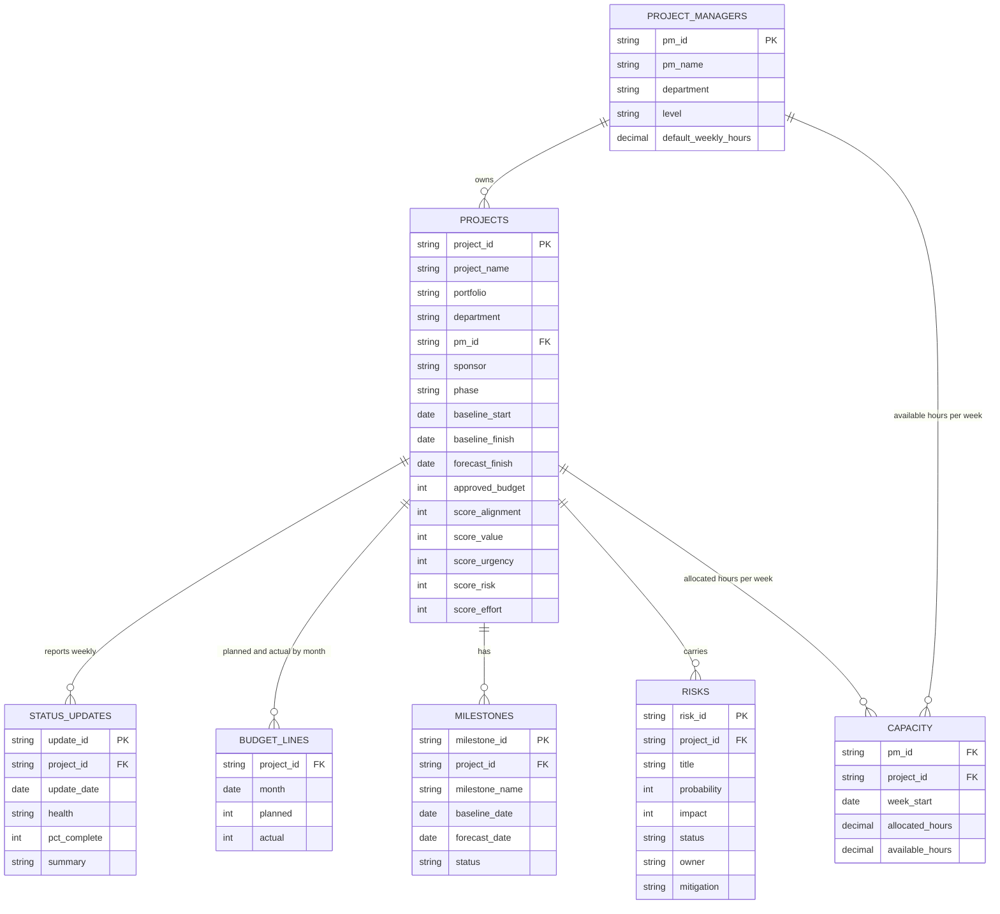

# Project Command Center: Data Model

**Version:** 0.1 (draft)
**Date:** 2026-09-02
**Companion doc:** `requirements.md`

Seven CSV files in `data/`. Each file is one entity. IDs are text, dates are ISO (`YYYY-MM-DD`), money is whole US dollars, hours are decimals.

---

## 1. Entity relationship diagram



## 2. Entities

### 2.1 `project_managers.csv`

One row per PM.

| Field | Type | Required | Allowed values / rules | Example |
|---|---|---|---|---|
| pm_id | string | Yes | Unique, format `PM-###` | PM-004 |
| pm_name | string | Yes | Fictional name | Dana Whitfield |
| department | string | Yes | IT Infrastructure, Applications, Data & Analytics, Security, Business Systems | Applications |
| level | string | Yes | Associate PM, PM, Senior PM, Program Manager | Senior PM |
| default_weekly_hours | decimal | Yes | > 0, default 40 | 40 |

### 2.2 `projects.csv`

One row per project. This is the "account record" of the CRM analogy.

| Field | Type | Required | Allowed values / rules | Example |
|---|---|---|---|---|
| project_id | string | Yes | Unique, format `PRJ-###` | PRJ-017 |
| project_name | string | Yes | | Service Desk Migration |
| portfolio | string | Yes | Run, Grow, Transform | Transform |
| department | string | Yes | Same list as PM department | IT Infrastructure |
| pm_id | string | Yes | Must exist in project_managers | PM-004 |
| sponsor | string | No | Fictional exec name; warn if blank | VP Operations |
| phase | string | Yes | Backlog, Planning, Executing, Closing, On Hold, Complete, Cancelled | Executing |
| baseline_start | date | Yes | | 2026-03-02 |
| baseline_finish | date | Yes | >= baseline_start | 2026-11-30 |
| forecast_finish | date | Yes | Current expected finish | 2026-12-18 |
| approved_budget | int | Yes | >= 0 | 240000 |
| score_alignment | int | Yes | 1 to 5, strategic alignment | 4 |
| score_value | int | Yes | 1 to 5, business value | 5 |
| score_urgency | int | Yes | 1 to 5 | 3 |
| score_risk | int | Yes | 1 to 5, higher = riskier | 2 |
| score_effort | int | Yes | 1 to 5, higher = more effort | 4 |

Active projects are those with phase in (Planning, Executing, Closing).

### 2.3 `status_updates.csv`

One row per weekly status report. The most recent row per project is the "current" status.

| Field | Type | Required | Allowed values / rules | Example |
|---|---|---|---|---|
| update_id | string | Yes | Unique, format `SU-####` | SU-0231 |
| project_id | string | Yes | Must exist in projects | PRJ-017 |
| update_date | date | Yes | | 2026-08-28 |
| health | string | Yes | Green, Yellow, Red | Yellow |
| pct_complete | int | Yes | 0 to 100 | 55 |
| summary | string | No | 1 to 2 sentence narrative | Vendor contract delayed two weeks; testing start moved. |

### 2.4 `budget_lines.csv`

One row per project per month. Planned is set at baseline; actual is filled in as months close.

| Field | Type | Required | Allowed values / rules | Example |
|---|---|---|---|---|
| project_id | string | Yes | Must exist in projects | PRJ-017 |
| month | date | Yes | First day of month | 2026-08-01 |
| planned | int | Yes | >= 0 | 22000 |
| actual | int | No | >= 0; blank for future months | 26400 |

Composite key: (project_id, month). Duplicates are rejected.

### 2.5 `milestones.csv`

| Field | Type | Required | Allowed values / rules | Example |
|---|---|---|---|---|
| milestone_id | string | Yes | Unique, format `MS-####` | MS-0088 |
| project_id | string | Yes | Must exist in projects | PRJ-017 |
| milestone_name | string | Yes | | UAT Sign-off |
| baseline_date | date | Yes | | 2026-10-15 |
| forecast_date | date | Yes | | 2026-10-29 |
| status | string | Yes | Not Started, In Progress, Complete, Missed | In Progress |

### 2.6 `risks.csv`

| Field | Type | Required | Allowed values / rules | Example |
|---|---|---|---|---|
| risk_id | string | Yes | Unique, format `RK-####` | RK-0042 |
| project_id | string | Yes | Must exist in projects | PRJ-017 |
| title | string | Yes | | Key vendor resource unavailable |
| probability | int | Yes | 1 to 5 | 3 |
| impact | int | Yes | 1 to 5 | 4 |
| status | string | Yes | Open, Mitigating, Closed | Open |
| owner | string | No | Warn if blank, set to Unassigned | Dana Whitfield |
| mitigation | string | No | | Secure backup contractor by 9/15 |

### 2.7 `capacity.csv`

One row per PM per project per week. `available_hours` repeats per row for the PM that week so time off can be reflected without a separate table.

| Field | Type | Required | Allowed values / rules | Example |
|---|---|---|---|---|
| pm_id | string | Yes | Must exist in project_managers | PM-004 |
| project_id | string | Yes | Must exist in projects | PRJ-017 |
| week_start | date | Yes | A Monday | 2026-08-31 |
| allocated_hours | decimal | Yes | >= 0 | 14 |
| available_hours | decimal | Yes | >= 0; below default when PTO | 32 |

Composite key: (pm_id, project_id, week_start).

## 3. Derived fields (calculated in `metrics.py`, never stored)

| Derived field | Formula | Source |
|---|---|---|
| current_health | health from latest status_update per project | status_updates |
| last_update_date | max(update_date) per project | status_updates |
| days_since_update | today minus last_update_date | status_updates |
| is_stale | days_since_update > 14 | derived |
| slip_days | forecast_finish minus baseline_finish | projects |
| planned_to_date | sum(planned) where month <= current month | budget_lines |
| actual_to_date | sum(actual) where month <= current month | budget_lines |
| budget_variance_pct | (actual_to_date minus planned_to_date) / planned_to_date x 100 | derived |
| burn_pct | actual_to_date / approved_budget x 100 | derived |
| burn_vs_progress | burn_pct minus pct_complete | derived |
| cpi | planned_to_date / actual_to_date (cost performance index) | derived |
| eac | actual_to_date + (approved_budget minus planned_to_date) / cpi | derived |
| risk_exposure | sum(probability x impact) where status != Closed | risks |
| priority_score | see section 4 | projects |
| pm_allocated_hours | sum(allocated_hours) per pm per week | capacity |
| pm_utilization_pct | pm_allocated_hours / available_hours x 100 | capacity |
| burnout_flag | utilization > 100 this week, or > 90 for 4+ consecutive weeks | capacity |
| suggested_health | Red if any of K3, K5, K6 is Red; Yellow if any is Yellow; else Green | derived |

## 4. Priority score

Inputs are the five 1 to 5 scores on the project record.
Risk and effort are inverted so a higher score always means "do this first."

```
inv_risk   = 6 - score_risk
inv_effort = 6 - score_effort

weighted = (w_alignment * score_alignment
          + w_value     * score_value
          + w_urgency   * score_urgency
          + w_risk      * inv_risk
          + w_effort    * inv_effort)

priority_score = (weighted - 1) / 4 * 100      # scales 1..5 to 0..100
```

Weights must sum to 1.0. Defaults: alignment 0.30, value 0.30, urgency 0.20, risk 0.10, effort 0.10.

Worked example, PRJ-017 (4, 5, 3, 2, 4):
weighted = 0.3 x 4 + 0.3 x 5 + 0.2 x 3 + 0.1 x 4 + 0.1 x 2 = 3.9
priority_score = (3.9 - 1) / 4 x 100 = **72.5**

## 5. Traffic-light thresholds (`config.py`)

| Metric | Green | Yellow | Red |
|---|---|---|---|
| budget_variance_pct | -10 to +10 | +10 to +20 | > +20 |
| burn_vs_progress | within 10 pts | 10 to 20 pts | > 20 pts |
| slip_days | <= 0 | 1 to 14 | > 14 |
| risk_exposure | < 8 | 8 to 15 | > 15 |
| pm_utilization_pct | 60 to 85 | 85 to 100 or < 60 | > 100 |
| days_since_update | <= 14 | 15 to 21 | > 21 |

## 6. Validation rules summary

**Reject (row dropped, logged with reason):**
missing or duplicate primary key, foreign key not found, value outside allowed list, negative money or hours, unreadable date, finish before start, duplicate composite key.

**Warn (row kept, flagged in Data Quality panel):**
blank sponsor, blank risk owner, stale status (14+ days), PM over 100% in any week, actual with no planned budget, pct_complete decreasing between updates.

**Silent fix:**
trim whitespace, title-case health and phase values, coerce numeric strings, normalize dates.

## 7. Seed data targets

| File | Rows (approx.) | Notes |
|---|---|---|
| project_managers.csv | 10 | 2 per department |
| projects.csv | 48 | ~32 active, mix of phases and portfolios |
| status_updates.csv | ~900 | weekly for 26 weeks per active project, includes a few stale projects |
| budget_lines.csv | ~600 | 12 months per project |
| milestones.csv | ~240 | 5 per project |
| risks.csv | ~150 | 2 to 5 per project |
| capacity.csv | ~1,200 | 26 weeks, includes 2 overloaded PMs and 1 underused |

Seed data will include deliberate defects (about 8% of rows) so the validation layer has something to catch: bad PM references, duplicate IDs, negative budgets, unknown health values, dates out of order.
