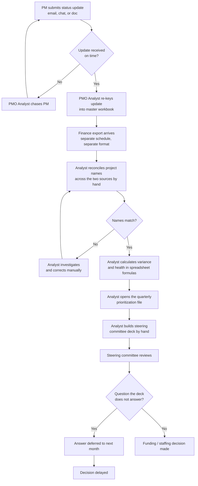
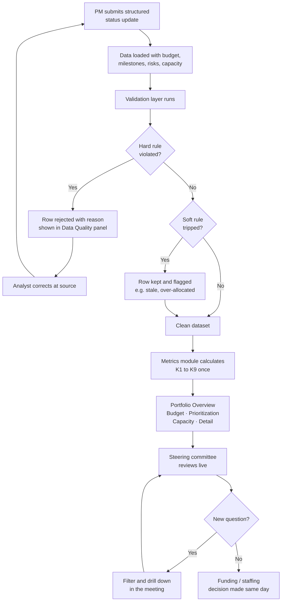

# Project Command Center: Current State and Future State Process

**Version:** 1.0
**Date:** 2026-09-22
**Author:** Magaly Gonzalez
**Related documents:** `requirements.md`, `stakeholders.md`, `user-stories.md`

---

## 1. Scope of the process under review

The process examined here is **the monthly portfolio review cycle**: everything that
happens between a project manager submitting a status update and the steering
committee making a funding or staffing decision.

It is not the project delivery process itself. Individual project execution is out
of scope.

**Process owner:** PMO Lead (ST-05)
**Frequency:** weekly status collection, monthly steering committee review
**Volume:** 40 to 60 active projects, 8 project managers

---

## 2. Current state

### 2.1 Narrative

Project managers email or message a status update to the PMO Analyst, in whatever
format each one has settled on. The PMO Analyst copies the content into a master
tracking workbook, chasing anyone who has not submitted.

Budget figures live in a separate finance export that arrives on a different
schedule. The PMO Analyst reconciles the two by hand, which means project names
have to be matched across two systems that spell them differently.

Prioritization is done once a quarter in a meeting, recorded in a third file, and
is usually out of date by the time it is referenced.

Capacity is not tracked in any system. The PMO Lead knows who is overloaded by
asking them.

The analyst then builds the steering committee deck manually, which takes most of
a day. Questions raised in the meeting that were not anticipated by the deck get
answered the following week.

### 2.2 Current-state process map

### 2.3 Pain point analysis

| ID | Pain point | Where it occurs | Consequence | Addressed by |
|---|---|---|---|---|
| PP-01 | Status updates arrive in inconsistent formats | Step A | Every update needs interpretation before it can be recorded | FR-01, standard data schema |
| PP-02 | Data is re-keyed from messages into a workbook | Step D | Transcription errors, and hours of clerical work per week | FR-01 |
| PP-03 | Project names do not match between the PMO workbook and the finance export | Steps F, G, H | Reconciliation is the single largest time cost in the cycle | FR-02, FR-03 (unknown key rejection) |
| PP-04 | Health is self-reported with no consistency check | Step I | Two projects in identical shape can be reported differently | K1, "suggested health" comparison |
| PP-05 | Variance formulas live in spreadsheet cells and drift between versions | Step I | The same KPI produces different numbers in different files | NFR-03, single metrics module |
| PP-06 | Prioritization is quarterly and stored separately | Step J | Decisions are made against a stale ranking | FR-30 to FR-34 |
| PP-07 | No capacity data exists anywhere | Not in the process | Overload is discovered after a project slips or someone burns out | FR-40 to FR-44 |
| PP-08 | Deck is assembled manually each month | Step K | Roughly one analyst day per cycle, repeated | FR-10 to FR-13, FR-60 |
| PP-09 | Unanticipated questions cannot be answered live | Steps M, N | Decisions slip by a full review cycle | FR-13 global filters, FR-50 drill-down |
| PP-10 | Stale projects are invisible because absence of data looks like no news | Throughout | A project can go quiet for a month before anyone notices | K8, FR-04 |

### 2.4 Quantifying the current state

These figures are modeled for a fictional 40 to 60 project portfolio. They are
assumptions used to size the opportunity, not measured results.

| Activity | Frequency | Effort per cycle | Annual effort |
|---|---|---|---|
| Chasing late status updates | Weekly | 1.5 hours | 78 hours |
| Re-keying updates into the workbook | Weekly | 2.0 hours | 104 hours |
| Reconciling finance export to project list | Monthly | 4.0 hours | 48 hours |
| Recalculating and checking KPI formulas | Monthly | 2.0 hours | 24 hours |
| Building the steering committee deck | Monthly | 7.0 hours | 84 hours |
| **Total** | | | **338 hours** |

At a loaded cost of $45 per hour, the current process consumes roughly **$15,210
per year** of analyst time, before counting the cost of decisions delayed by a
review cycle.

---

## 3. Future state

### 3.1 Narrative

Project managers submit a structured status update against a fixed schema. The
data lands in a single dataset alongside budget, milestones, risks, and capacity.

Validation runs before anything is calculated. Rows that fail a hard rule are
rejected with a stated reason and shown in a Data Quality panel. Rows that trip a
soft rule are kept but flagged. Nobody reconciles names by hand, because an
unknown key is a rejection with a reason attached rather than a puzzle.

Every KPI is defined once, in one module, and calculated identically on every page.

The steering committee reviews the dashboard live rather than a deck built from it.
When a question comes up that nobody anticipated, the filters answer it in the
meeting instead of the following month.

### 3.2 Future-state process map

### 3.3 What changes, step by step

| Current state step | Future state | Why it improves |
|---|---|---|
| Free-form update in any format | Structured submission against a fixed schema | Removes interpretation, makes validation possible |
| Manual re-keying | Direct load from the dataset | Removes the transcription error class entirely |
| Hand reconciliation of names | Unknown key is rejected with a reason | Turns a search problem into a correction task |
| Spreadsheet formulas per file | One metrics module used by every page | The same KPI cannot produce two numbers |
| Quarterly priority file | Live scoring with adjustable weights | Ranking is current, and the formula is inspectable |
| Capacity known by asking people | Allocation vs. available hours, with burnout flags | Overload is visible before it becomes a slip |
| Deck assembled by hand | Dashboard reviewed live, tables exportable | Removes the assembly step, answers questions in the room |
| Unanticipated question deferred | Filters and drill-down answer it live | Decisions stop slipping a review cycle |

### 3.4 Modeled impact

| Activity | Current annual hours | Future annual hours | Saved |
|---|---|---|---|
| Chasing late status updates | 78 | 39 | 39 |
| Re-keying updates | 104 | 0 | 104 |
| Reconciling finance export | 48 | 12 | 36 |
| Recalculating and checking KPIs | 24 | 0 | 24 |
| Building the steering deck | 84 | 24 | 60 |
| **Total** | **338** | **75** | **263** |

**Modeled annual saving: 263 analyst hours, approximately $11,835 at $45 per hour.**

Assumptions behind the figures:

- Chasing is halved rather than eliminated, because a dashboard does not make
  people submit on time. K8 only makes the gap visible.
- Reconciliation drops to 12 hours rather than zero, because genuinely new or
  renamed projects still need a human decision.
- Deck assembly drops to 24 hours rather than zero, because the committee will
  still want a narrative summary alongside the live view.
- These are modeled figures on a fictional portfolio. They size an opportunity.
  They are not a measured outcome.

---

## 4. Gap analysis

| Gap | Current capability | Required capability | Requirement |
|---|---|---|---|
| No enforced data schema | Free-form updates | Fixed schema with validation on load | FR-01, FR-02, FR-03 |
| No visibility into data quality | Errors found during deck building, if at all | Rejected rows with reasons, shown and exportable | FR-05 |
| Inconsistent KPI math | Formulas per spreadsheet | Single shared metrics module | NFR-03 |
| No live prioritization | Quarterly file | Runtime scoring with adjustable weights | FR-30 to FR-34 |
| No capacity data | Nothing | Allocation vs. available hours per PM per week | FR-40 to FR-43 |
| No burnout early warning | Discovered after the fact | Flag at over 100% now, or over 90% for four weeks | FR-43 |
| No self-service drill-down | Analyst answers ad hoc questions | Global filters and project detail views | FR-13, FR-50 |
| Staleness invisible | Silence reads as no news | Explicit stale-status KPI | K8, FR-04 |

---

## 5. Assumptions and constraints on the future-state process

- Project managers remain the source of truth for health. The tool surfaces a
  disagreement between reported and computed health, but does not overwrite it.
  This is decision D2 in `stakeholders.md`.
- v1 does not integrate with Jira, Asana, Workfront, or ServiceNow. Data arrives
  as CSV. Integration is a v2 candidate.
- The dashboard is read-only. Corrections happen at the source, not in the app.
- Weekly cadence is retained. The future state changes what happens to a status
  update, not how often one is submitted.
