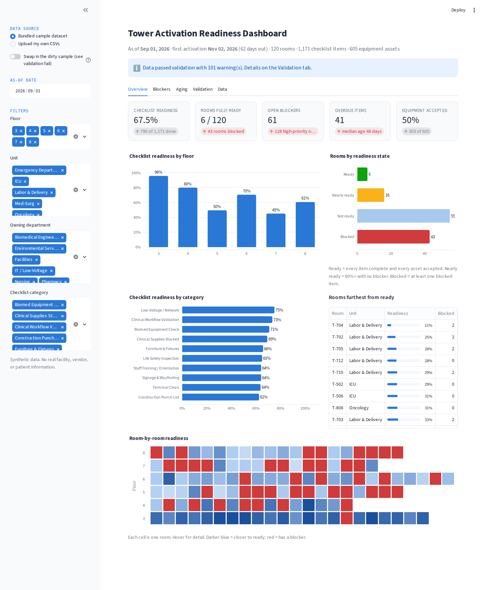
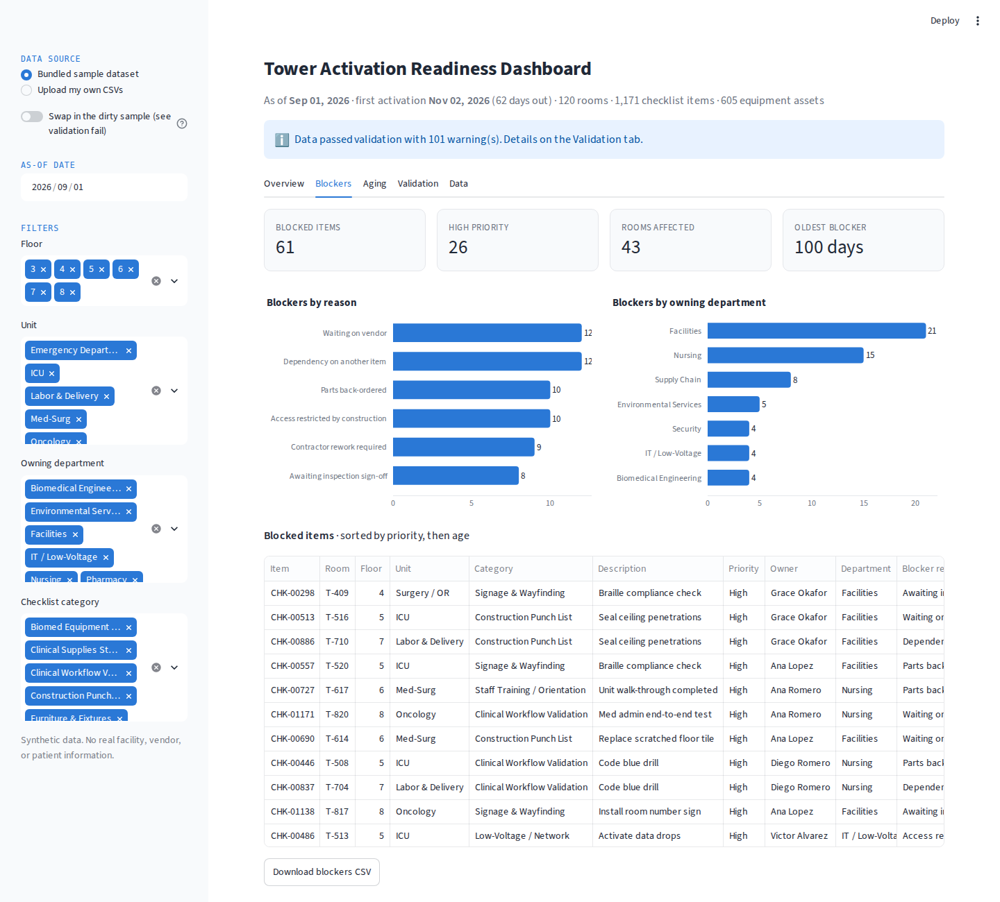
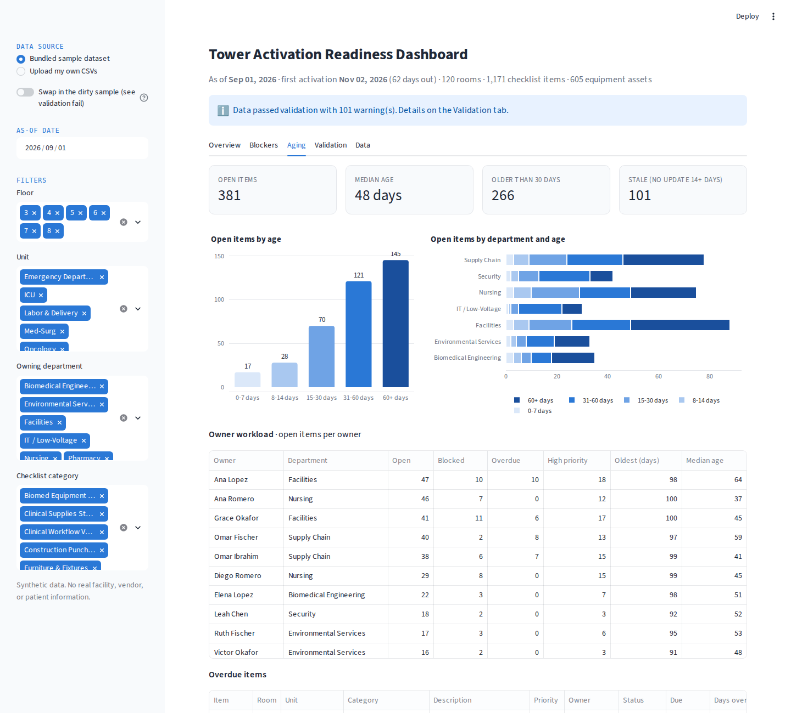
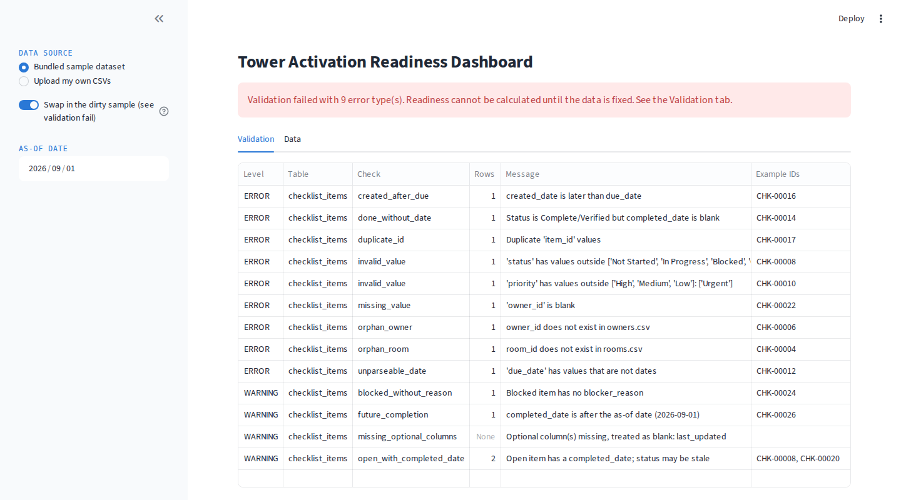

# Tower Activation Readiness Dashboard

A Streamlit + pandas dashboard that tracks how ready a new hospital tower is to open:
room-by-room readiness, blockers, overdue work, and aging items across facilities,
biomed, IT, nursing, pharmacy, security, EVS, and supply chain.

Built as a portfolio project modeled on facility-activation work (new patient tower
opening, hundreds of rooms, thousands of checklist items owned by a dozen departments).
All data is synthetic.



## What it does

**Validates before it calculates.** Every CSV runs through a validation step first.
Errors (missing columns, blank required fields, duplicate IDs, bad status values,
unparseable dates, room or owner IDs that do not exist, completed items with no date)
stop the dashboard and show a findings table. Warnings (stale items, blocked items with
no reason, future completion dates) let it run but are reported.

**Readiness.** Checklist readiness % (items Complete or Verified over total), rooms fully
ready (every item done and every equipment asset accepted), readiness by floor and by
category, a room-by-room grid, and the ten rooms furthest from ready.

**Blockers.** Blocked items by reason and owning department, with a sortable table
(priority, age, days since last update) and a CSV download.

**Aging.** Open items bucketed 0-7 / 8-14 / 15-30 / 31-60 / 60+ days, aging by department,
owner workload, and the overdue list. Everything is relative to an adjustable as-of date so
the numbers are reproducible on any day.

**Filters.** Floor, unit, owning department, checklist category.

**Bring your own data.** Upload four CSVs in the sidebar, or toggle the bundled "dirty"
sample to see the validator fail on purpose.

| Blockers | Aging | Validation failing |
|---|---|---|
|  |  |  |

## Run it

```bash
pip install -r requirements.txt
streamlit run app.py
```

Regenerate the dataset (seeded, same output every time):

```bash
python src/generate_data.py
```

Run the validator from the command line (exit code 1 on errors):

```bash
python src/validate.py                                        # bundled data
python src/validate.py data/samples/checklist_items_dirty.csv # dirty sample
```

Tests:

```bash
python -m pytest -q
```

## Data model

| File | One row per | Key columns |
|---|---|---|
| `rooms.csv` | room | room_id, floor, unit, room_type, target_activation_date |
| `owners.csv` | accountable person | owner_id, owner_name, department |
| `equipment.csv` | equipment asset | equipment_id, room_id, category, status (Ordered → Delivered → Installed → Tested → Accepted), owner_id |
| `checklist_items.csv` | activation task | item_id, room_id, category, owner_id, status (Not Started / In Progress / Blocked / Complete / Verified), priority, created_date, due_date, completed_date, last_updated, blocker_reason |

## Validation rules

| Check | Level |
|---|---|
| Required columns present | Error |
| Required fields not blank | Error |
| Primary keys unique | Error |
| `status` / `priority` in the allowed vocabulary (case and whitespace normalised first) | Error |
| Dates parse | Error |
| `room_id` / `owner_id` exist in the reference tables | Error |
| Complete/Verified items have a `completed_date` | Error |
| `created_date` not after `due_date` | Error |
| Open item carries a `completed_date` | Warning |
| `completed_date` after the as-of date | Warning |
| Blocked item has no `blocker_reason` | Warning |
| Open item not updated in 14+ days | Warning |

## Project layout

```
app.py                  Streamlit app
src/generate_data.py    seeded synthetic dataset
src/validate.py         schema + cross-table validation, CLI entry point
src/metrics.py          readiness, blockers, aging calculations
data/                   bundled CSVs (+ samples/checklist_items_dirty.csv)
tests/                  pytest
docs/                   screenshots
```

## Design notes

- The validator is separate from the app so the same rules can run in a nightly job or a CI check.
- Metrics functions take an explicit `as_of` date instead of `today()` so results are testable and the bundled sample tells the same story every time.
- Colors: one blue ramp for magnitude; red / yellow / green reserved for readiness state and never reused for a series.

Synthetic data only. No real facility, vendor, staff, or patient information.
